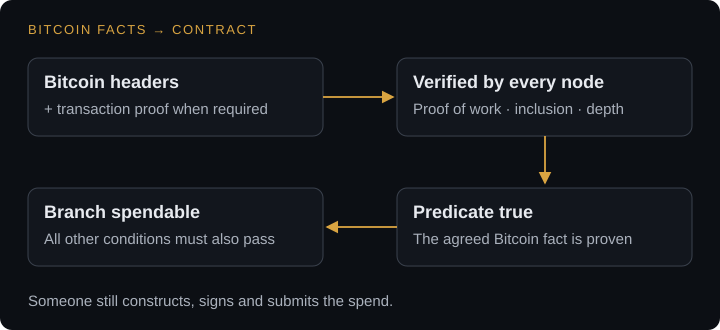

# Bitcoin facts in contracts

A contract tied to Bitcoin should not need a person to report facts that Bitcoin already proves. BATHRON carries a verified Bitcoin header view into consensus and checks transaction evidence against it. Every node evaluates the same condition from the same accepted data.

Operators have an interest in relaying Bitcoin headers, and several can do so; no relay is designated. Each node checks proof of work and the other header rules, so relaying data gives no authority to invent a fact. Contracts use the verified history through predicates: statements that pass or fail.

## Four families of facts

| Fact | What a contract can require |
|---|---|
| Difficulty | Difficulty at a specified height is at or above a threshold, or below it |
| Height | The readable Bitcoin history reaches a specified height |
| Median time | Bitcoin median time at a specified point reaches a threshold |
| Payment | A transaction pays at least an agreed amount to a specified output script, with the required proof and depth |

The two difficulty comparisons make five predicates in total. A predicate asserts a condition; it does not return an arbitrary numerical reading for a program to manipulate.

<figure class="protocol-diagram" tabindex="0" aria-label="Bitcoin headers and proofs → verified by every node → predicate true → branch spendable when all other conditions pass.">
  
</figure>

## Use an exact observation

A difficulty agreement names the Bitcoin height and threshold. A payment condition names the output script, minimum amount and confirmation requirement. A time condition names Bitcoin's median time, which differs from a user's wall clock.

Only history admitted by the protocol's depth and validation rules is usable. A transaction visible to a wallet is not automatically eligible contract evidence. Applications distinguish seeing an event from proving a condition that consensus accepts.

For a payment, a Merkle branch ties the transaction to a header. The verifier also checks the transaction's relevant outputs and the required depth. A transaction identifier alone does not establish who receives what.

## Compose the fact with the agreement

A covenant can bind a proven payment to a fixed destination. A timelock can provide a recovery branch. A difficulty threshold can select between two agreed distributions. Comparisons at two observation heights can test predefined threshold combinations. They do not return the two difficulty values or calculate an arbitrary change between them; a change-based payoff needs an explicit construction.

These facts do not contain an exchange rate, another chain's state or a physical event. Applications using those observations identify an external attestation source. Nor is cumulative chainwork a script query: chainwork serves header verification, a separate responsibility.

See [Contracts on Bitcoin facts](bitcoin-contracts.md) for application examples, [Bitcoin verification](bitcoin-verification.md) for the evidence path, and [Script reference](script.md) for the predicate names. Keep the commercial meaning and the exact machine condition side by side when presenting an agreement.
