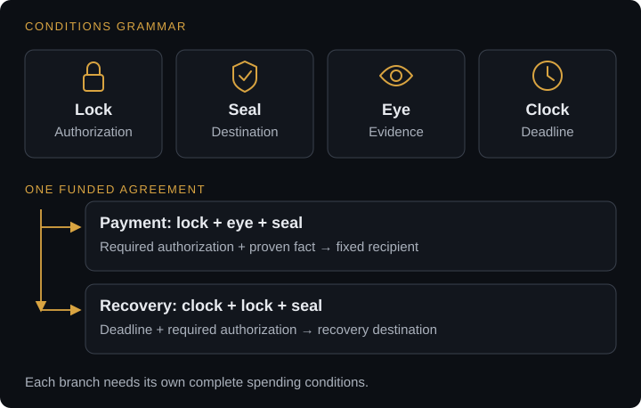

# Composable settlement

Agreements often need several conditions at once. A payment may require authorization, a specific destination, evidence of delivery and a deadline. BATHRON lets builders combine these conditions in scripts rather than ask consensus to recognize a new product category.

The primitives compose. A market, an escrow and an inventory policy can use the same building blocks while expressing different agreements.

## Four pictures for a contract

| Picture | Meaning | Building blocks |
|---|---|---|
| Lock | Who can open a spending path, or which secret opens it | Signatures and hashlocks |
| Seal | What the resulting transaction must preserve | Templates, output constraints and recursive covenants |
| Eye | What evidence the contract checks | Bitcoin predicates and authenticated external statements |
| Clock | When a spending path becomes eligible | Absolute and relative timelocks |

The eye does not observe everything. It checks a specified Bitcoin fact or the authenticity of a specified statement.

## Assemble a payment

Suppose Alice pays Bob when Bob's Bitcoin payment satisfies their agreement. The seal fixes the destination of the BATHRON payment. The eye checks the Bitcoin payment evidence. The lock specifies any required authorization. The clock supplies a separate recovery condition if the agreement remains unsettled.

<figure class="protocol-diagram" tabindex="0" aria-label="Lock, seal, eye and clock compose one funded agreement with separate payment and authorized recovery branches.">
  
</figure>

This diagram is an agreement outline, not an executable script. The builder defines the precise branches, including what happens when more than one spend is eligible. A recovery path must be constructed as carefully as the successful payment.

## Carry rules forward

A recursive covenant constrains a successor output to retain a policy. This supports repeated operations, such as an inventory withdrawal process that preserves controls on the remaining balance. Recursion here means rules carried through transactions. It does not mean an unbounded loop executed inside one script.

For facts outside Bitcoin, a discreet log contract, or DLC, can organize funding, outcome branches and a timed recovery around an external attestation. The application chooses the statement and source. Consensus checks the cryptographic conditions, not the source's business judgment.

## Build with a clear boundary

An application using existing primitives defines its own terms without changing consensus. A new primitive requires a specification and review because it changes what every validating node must understand.

Describe each branch in plain English before translating it into transactions. Identify the evidence, signer, destination and timing. Then check both valid and rejected spends. [Build an application](build.md) develops this workflow; [Script reference](script.md) describes the individual operations.
