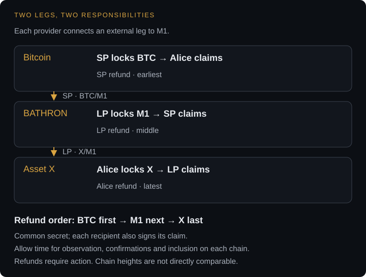

# Settlement across chains

A customer wants to send one asset and receive another. Those assets may live under different chain rules, with separate transactions and confirmation processes. A cross-chain application coordinates these legs while making each party's obligations explicit.

BATHRON settles the M1 leg. It can verify specified Bitcoin facts, but it cannot issue commands to Bitcoin or another chain. The provider handles the external leg and the application coordinates the agreement.

## Two provider specializations

A **Settlement Provider (SP)** handles BTC/M1. It carries an Operator identity and can provide the service with or without producing blocks. Its work includes inventory, quoting and orchestration of the Bitcoin leg.

A **Liquidity Provider (LP)** handles X/M1. An Operator identity is optional. The LP manages the external asset and the chain-specific execution needed to connect it to M1.

An application can route through these services to give a customer an asset-to-asset experience. The route needs executable terms on each connection.

## Link conditions carefully

Hashlocks can link two spends to a common secret. Claiming one leg reveals information usable on the other. Timelocks provide recovery paths with deliberately ordered deadlines. Each participant verifies amounts, destinations, hash commitments and timing before committing value.

The complete construction includes chain observation, confirmation policy, transaction submission and recovery. Each external chain requires its own transaction construction and execution analysis.

A Bitcoin payment proof offers another composition. A BATHRON covenant can require evidence that the agreed Bitcoin payment is confirmed. That condition verifies payment evidence; the application's full flow still determines how the parties fund and complete their obligations.

## Example: stablecoin → BTC through an LP and an SP

Alice holds a stablecoin X and wants BTC. The LP quotes X/M1; the SP quotes BTC/M1 and carries an Operator identity. This construction assumes that X's chain supports compatible hashlocks and timed refunds. It describes an agreement flow, not a claim that a particular stablecoin integration is supplied.

### Agree before funding

The quote fixes **x** stablecoin units from Alice, **m** M1 from the LP and **b** BTC from the SP, including provider charges. Each participant also reserves the native asset needed for transaction fees on the chains where it acts. Alice generates a fresh secret **s** and shares only its hash **h**. Each claim requires both the secret and the designated recipient's authorization.

The three refund deadlines are ordered so the BTC refund opens first, the M1 refund later, and the stablecoin refund last. Participants translate each chain's clock into an operational schedule with margins for observation, confirmations and inclusion; raw block heights on different chains are not comparable. They also agree an earlier cutoff after which Alice must not begin revealing the secret.

| Funded leg | Success path | Refund path |
|---|---|---|
| Alice locks x X on X's chain | LP claims with s and its key | Alice recovers with her key after the latest deadline |
| LP locks m M1 on BATHRON | SP claims with s and its key | LP recovers with its key after the middle deadline |
| SP locks b BTC on Bitcoin | Alice claims with s and her key | SP recovers with its key after the earliest deadline |

<figure class="protocol-diagram" tabindex="0" aria-label="Bitcoin: SP funds BTC for Alice, earliest refund. BATHRON: LP funds M1 for SP, middle refund. Asset X: Alice funds X for LP, latest refund. Claims require the shared secret and recipient authorization.">
  
</figure>

### Fund and complete

1. **Alice locks X.** She checks both quotes and all proposed scripts, retains recovery data and funds the stablecoin leg. The LP verifies its amount, recipient, hash, refund terms and the agreed confirmations before proceeding.
2. **The LP locks M1.** Its inventory funds the middle leg payable to the SP. The SP verifies that output, the common hash, timing margins and BATHRON finality before committing BTC.
3. **The SP locks BTC.** Alice checks the Bitcoin output, amount, destination, hash and refund terms, then waits for the agreed confirmations. She still controls the secret and checks that sufficient claim time remains.
4. **Alice claims BTC.** She signs the claim to her destination, revealing s on Bitcoin. The SP observes the secret and uses it with its own key to claim the M1 before the LP's refund becomes eligible.
5. **The LP claims X.** It obtains s from the Bitcoin or BATHRON claim and uses its key to claim X before Alice's refund becomes eligible. Each participant verifies completion on the chain where it receives funds.

Alice ends with BTC, the LP with X and the SP with M1. Alice never needs to hold M1 or hand her wallet keys to either provider. The application coordinates transactions; the scripts determine who can spend each funded leg.

### If a participant disappears

Before the secret is revealed, each funder recovers any unspent commitment through its own refund path. If the LP disappears before funding M1, Alice submits her X refund after its deadline. If the SP disappears before funding BTC, the LP refunds M1 and Alice refunds X at their respective deadlines. If Alice disappears after all three legs are funded, the SP, LP and Alice's returning wallet each submit their own refunds as their deadlines arrive.

Once Alice reveals s, the SP and LP can claim independently: neither needs another message or signature from Alice or from each other. If the SP stops after Alice's claim, the LP can read s directly from Bitcoin. The SP still needs to return or use its assigned monitoring process in time to collect M1. A participant that misses its claim window can lose its outgoing funds while the upstream funder refunds; the [recovery boundaries](trust.md#privacy-and-economic-boundaries) therefore form part of the agreement.

### What is public

For this example, all three conditional legs use public amounts, recipients, hash commitments and deadlines. Claims reveal s, linking the legs. M1 funding and spending are public on BATHRON, and the SP's Operator identity is public. Quotes are visible to their recipients and any discovery service carrying them; the parties retain their own keys and recovery records.

See [Conditional payments and escrow](escrow.md) for branch design and [Operate a provider](providers.md) for monitoring and inventory responsibilities.
