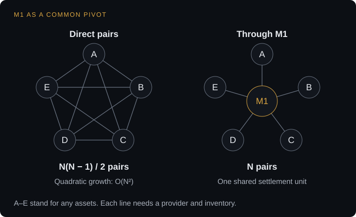

# M1: the settlement pivot

Connecting every asset directly to every other asset multiplies the number of markets that providers must maintain. A common settlement pivot reduces that coordination burden. BATHRON uses M1 for the internal side of professional settlement, while providers handle the assets their customers want to send or receive.

End users settle in the assets they already hold; market builders and providers settle in M1. An application can organize the intermediate operations without making its customer manage M1 inventory.

## A hub for settlement

With N assets, a complete set of direct pairs grows quadratically. Pairing each asset with M1 gives N connections to a common hub. Each provider uses the same internal unit across its connections.

<figure class="protocol-diagram" tabindex="0" aria-label="N assets require N(N − 1)/2 direct pairs, or N connections through M1; every connection needs inventory and a provider.">
  
</figure>

Each connection still needs inventory, an executable quote and a provider responsible for the external leg. A route through the hub is a commercial service assembled from those connections.

## Why burn BTC?

Burning BTC creates M0, which can be locked one for one to create M1, the settlement unit a provider uses to quote pairs. One M1 inventory can be offered against any asset another provider quotes, giving it a common connection to all LPs through their quoted terms. For an Operator, the identity ticket burn is the entry capital for its identity: an irreversible cost, separate from inventory available for settlement.

## Where M1 comes from

```text
BTC → irreversible, verified destruction → M0
M0  → lock one for one                  → M1
M1  → unlock one for one                → M0
```

M0 records the base units issued from the burn; M1 represents those units while they are vaulted. Contracts and providers handle M1 as their settlement unit. The two representations separate base-unit ownership from settlement receipts, with consensus enforcing their one-for-one relationship.

## Accounting and settlement {#accounting-and-exchange}

Unlocking returns M0. Obtaining BTC is a market transaction with a provider supplying BTC inventory. Providers price inventory, waiting, execution and demand; lock and unlock transactions also incur network fees. See [Where trust lives](trust.md) for the economic boundaries.

Professionals can acquire existing M0 or M1 from holders rather than create new origin units themselves. Transfers change ownership; they do not change provenance.

Read [Monetary invariants](invariants.md) for the conservation rules, [How markets emerge](markets.md) for inventory and quoting, and [Settlement across chains](cross-chain.md) for the distinction between unlocking M1 and receiving BTC from a provider.
