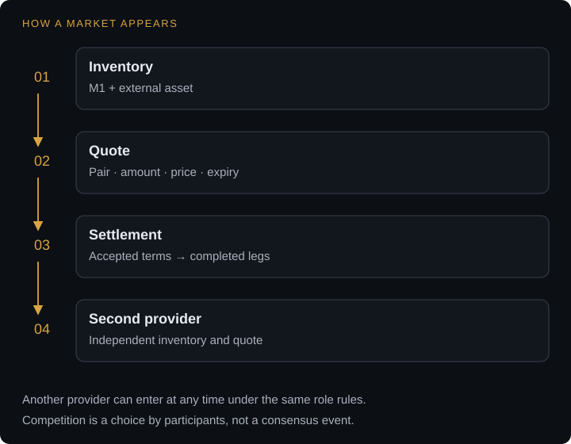

# How markets emerge

A market needs someone willing to quote and enough inventory to honor the accepted terms. BATHRON does not grant a listing before that can happen. A pair exists because someone quotes it and can arrange its settlement.

Bitcoin does not decide who may hold BTC. BATHRON does not decide which markets may exist. Market discovery and competition take place outside consensus.

## From inventory to competition

<figure class="protocol-diagram" tabindex="0" aria-label="Inventory → quote → settlement → a second independent provider. Another provider may enter at any time under the same role rules.">
  
</figure>

First, a provider holds inventory in M1 and the external asset. It can acquire existing internal units from holders or use the [origin route](m1.md). Creating origin units destroys BTC irreversibly, so its cost belongs in the provider's business calculation.

Second, the provider publishes a quote describing the pair, direction, amount, price, fees and expiry. An application can discover offers directly, through announcements, or through relays and indexers. An endpoint announcement can use ordinary on-chain data while discovery remains outside consensus. It points to a service; it is not protocol approval of that service.

Third, a user accepts terms and the application constructs the settlement. The M1 leg follows BATHRON rules. The external leg follows its own chain and the agreed execution process.

Another provider can quote the same pair under the same protocol rules and the identity requirements of its role. Customers compare terms and choose where to transact.

## Quotes are commercial commitments

A quote and a funded contract are different objects. Applications specify when an offer becomes binding, how long it remains usable and whether inventory is reserved.

An offer that remains exercisable while prices move gives the taker an option. Providers account for that option through expiry, commitment requirements or spread. These choices belong to the service's terms; consensus does not price them.

Relays can compete in coverage and accessibility. Indexers can publish observations such as completed operations and service history. Reputation is built from those facts by users and applications. The protocol does not turn them into a preferred-provider ranking.

## A pair can fall silent

If nobody quotes a pair, it is silent, not delisted. There is no administrative listing to revoke. Someone can quote it again under the same settlement rules.

Inventory, customers and prices come from participants.

[Who does what](roles.md) distinguishes the BTC/M1 Settlement Provider from the X/M1 Liquidity Provider. [Operate a provider](providers.md) covers the operational work behind an executable quote.
